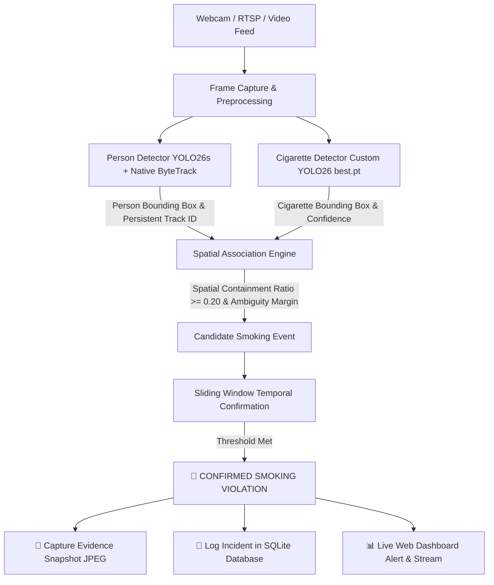
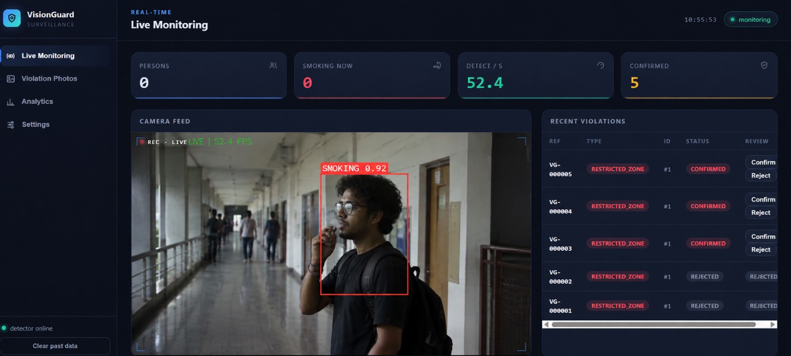
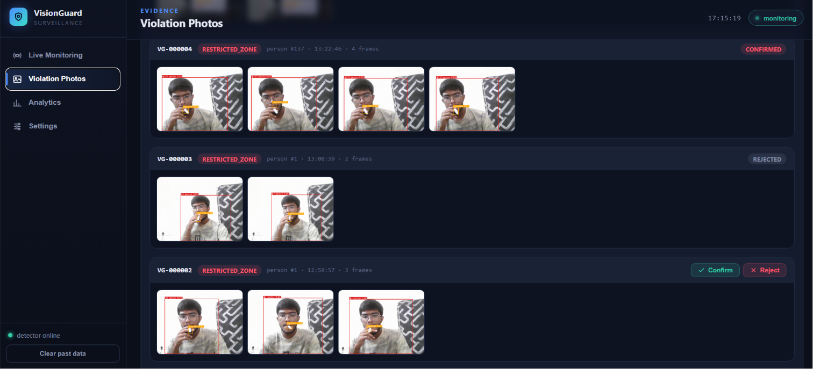
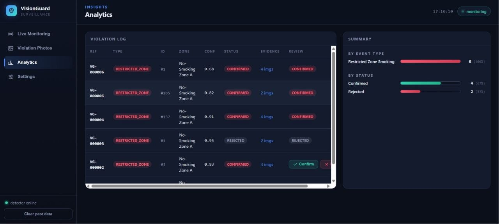

# 🛡️ VisionGuard: AI-Powered Smoking & Restricted Area Compliance System

> Real-time cigarette detection and human compliance tracking system built using YOLO26, ByteTrack multi-object tracking, spatial containment, temporal multi-frame confirmation, evidence snapshot generation, and a live web monitoring dashboard.

---

## 📌 System Architecture



---

## 📂 Streamlined Repository Structure

```
Smoking-detection/
├── visionguard/               # Main VisionGuard Core Package & Web Application
│   ├── app.py                 # FastAPI Web Application & API endpoints
│   ├── camera.py              # Decoupled 50+ FPS Camera capture & MJPEG streaming loop
│   ├── detector.py            # YOLO26s Person Tracking + YOLO26 Cigarette Inference Engine
│   ├── draw.py                # Live Video Overlays (HUD, Bounding Boxes, Alert Banner)
│   ├── violation_engine.py    # Spatial Association & Temporal Multi-frame Confirmation
│   ├── db.py                  # SQLite Event Database Connection & Logging
│   ├── models.py              # Database Models & Event Schemas
│   ├── config.yaml            # Tunable System Thresholds & Parameters
│   └── static/                # Live Monitoring Dashboard UI (HTML / JS / CSS)
│
├── person_detector.py         # Standalone Person Detection & ByteTrack Tracking Script
├── train_cigarette.py         # Roboflow Dataset Downloader & YOLO26 Training Pipeline
├── requirements.txt           # Project Dependencies
└── README.md                  # System Documentation
```

---

## ⚡ Quick Start Guide

### 1️⃣ Installation
Ensure Python 3.10+ and PyTorch are installed:
```bash
pip install -r requirements.txt
```

### 2️⃣ Run VisionGuard Live Web Dashboard
Launch the web application on port 8000:
```bash
cd visionguard
python -m uvicorn app:app --host 0.0.0.0 --port 8000
```
Open **`http://localhost:8000`** in your browser.

### 3️⃣ Standalone Person Tracker (YOLO26s + ByteTrack)
To run standalone webcam human tracking with persistent IDs:
```bash
python person_detector.py
```

### 4️⃣ Train Custom Cigarette Detection Model (YOLO26s)
To train or fine-tune a cigarette detection model using the Roboflow dataset:
```bash
python train_cigarette.py
```

---

## 🌐 Features
- **Strict Human-Only Person Detection**: Uses pretrained COCO YOLO26s to track human beings with persistent ByteTrack IDs (`#1 person`, `#2 person`).
- **Precision Cigarette Detection**: Trained on 4,000+ labelled smoking dataset images with Small-Target-Aware Label Assignment (STAL).
- **Decoupled 50+ FPS Video Streaming**: Camera streaming is decoupled from deep inference passes for smooth, lag-free playback.
- **Automatic Evidence Snapshots**: Automatically captures JPEG evidence snapshots and logs violations to an SQLite database (`visionguard.db`).


---

## Dashboard Screenshots

| Live Monitoring | Violation Photos | Analytics |
|---|---|---|
|  |  |  |
